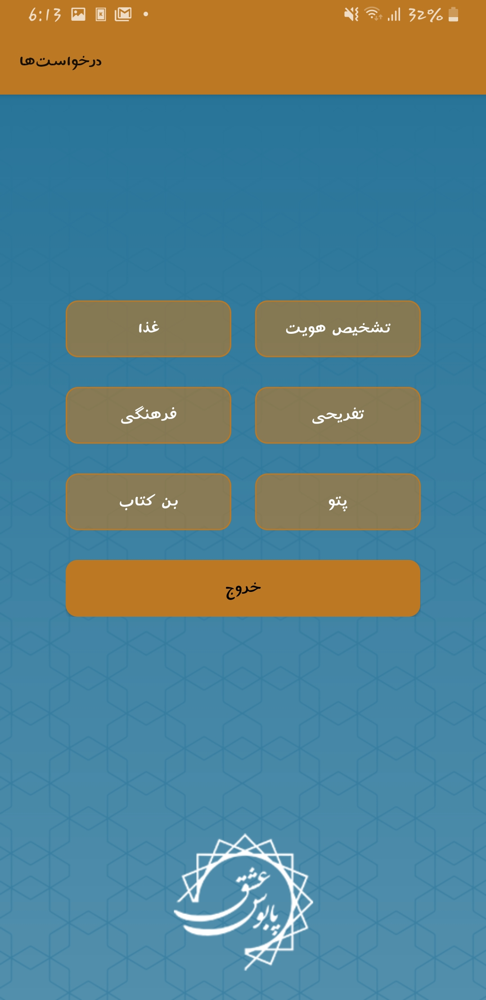
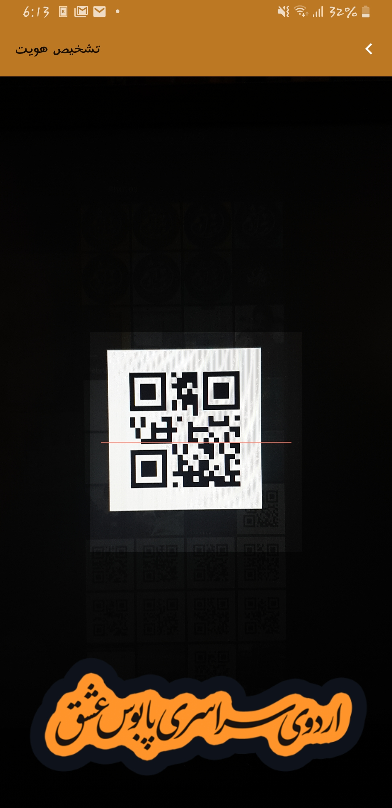

# PaboosYar
When you take some people (about 1000 persons) to travel, you certainly need statistics for people who ate food or want to go to a museum or...

This app is a qrcode scanner for our Paboos Travel that scans each passenger's QR-code and in addition to give all information about that passenger, it checks in him for launch and museum and etc.

Here are some pictures of the UI:

  
  
  
  

